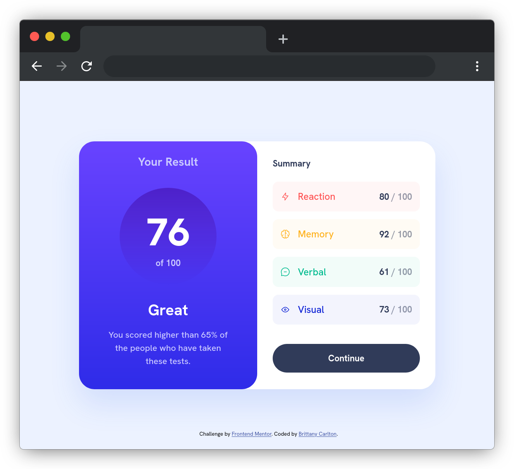

# Frontend Mentor - Results summary component solution

This is a solution to the [Results summary component challenge on Frontend Mentor](https://www.frontendmentor.io/challenges/results-summary-component-CE_K6s0maV). Frontend Mentor challenges help you improve your coding skills by building realistic projects. 

## Table of contents

- [Frontend Mentor - Results summary component solution](#frontend-mentor---results-summary-component-solution)
  - [Table of contents](#table-of-contents)
  - [Overview](#overview)
    - [The challenge](#the-challenge)
    - [Screenshot](#screenshot)
    - [Links](#links)
  - [My process](#my-process)
    - [Built with](#built-with)
    - [What I learned](#what-i-learned)
    - [Useful resources](#useful-resources)
  - [Author](#author)

## Overview

### The challenge

Users should be able to:

- View the optimal layout for the interface depending on their device's screen size
- See hover and focus states for all interactive elements on the page

### Screenshot

### Links

- [GitHub Repo](https://github.com/devBritt/literate-fortnight)
- [Live Site](https://devbritt.github.io/literate-fortnight/)

## My process

### Built with

- Semantic HTML5 markup
- CSS3
- Stylus CSS Preprocessor
- Flexbox
- Mobile-first workflow

### What I learned

This was a fun, quick little challenge that helped reinforce concepts from the full-stack web development bootcamp I participated in. In particular, I really needed a refresher on mobile-first development and the CSS flexbox. My favorite part, though, was using Stylus. It was really useful and made creating the stylesheet for this project much faster!

### Useful resources

- [Stylus Docs](https://stylus-lang.com/docs/executable.html) - I referenced the Stylus docs quite a bit for this challenge and found that it is really well written and organized.

## Author

- GitHub - [Brittany Carlton](https://github.com/devBritt)
- Frontend Mentor - [@devBritt](https://www.frontendmentor.io/profile/devBritt)
- Twitter - [@devBritt07](https://twitter.com/devBritt07)
